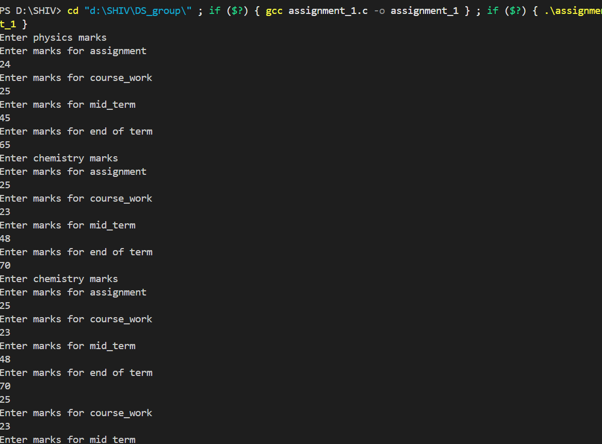
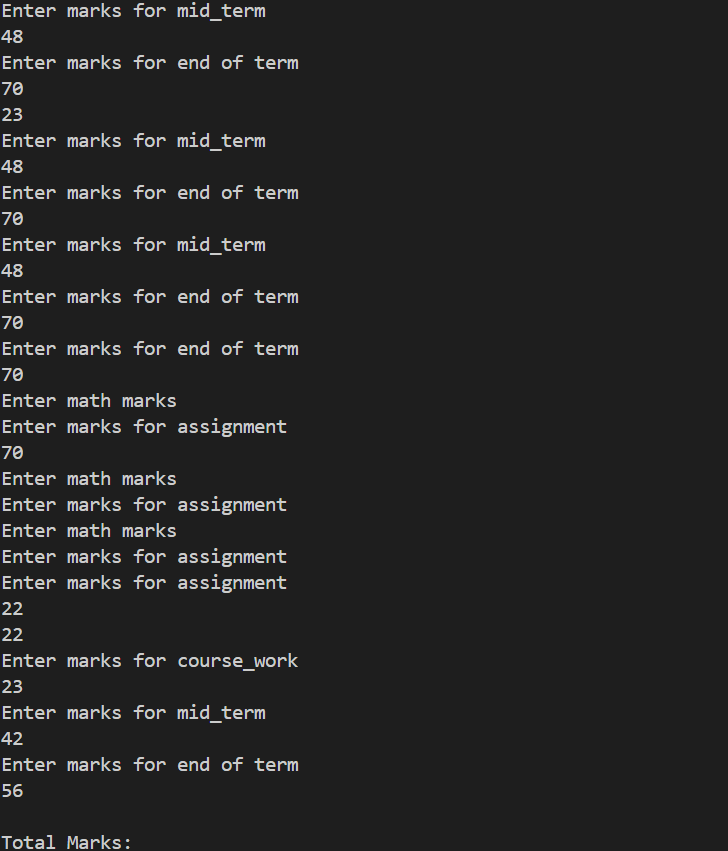
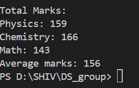

Group Members
1. SHIV RAJESH JADHAV  Bsci Computer Science
2. OMAR 
3. Jenny Namutebi
4.Aisha Nakidde
DATA STRUCTURES AND ALGORITHMS ASSIGNMENTS

This is repo for all our group assignments

## Output Screenshots

26th-02-2025

Assignment_1 

 Write a C program that calculates the average of marks got by a student in three subjects ie Physics, Chemistry, Math...assume for each subject, four different tests were conducted; assignment, Course work, mid term and end of term exams.

### Screenshot 1

### Screenshot 2  

### Screenshot 3  

Assignment_2
Write a C program that accepts a group of N domestic animals and a group of X wild animals. Your program should print N + X animals after entering each group

### Screenshot 1

