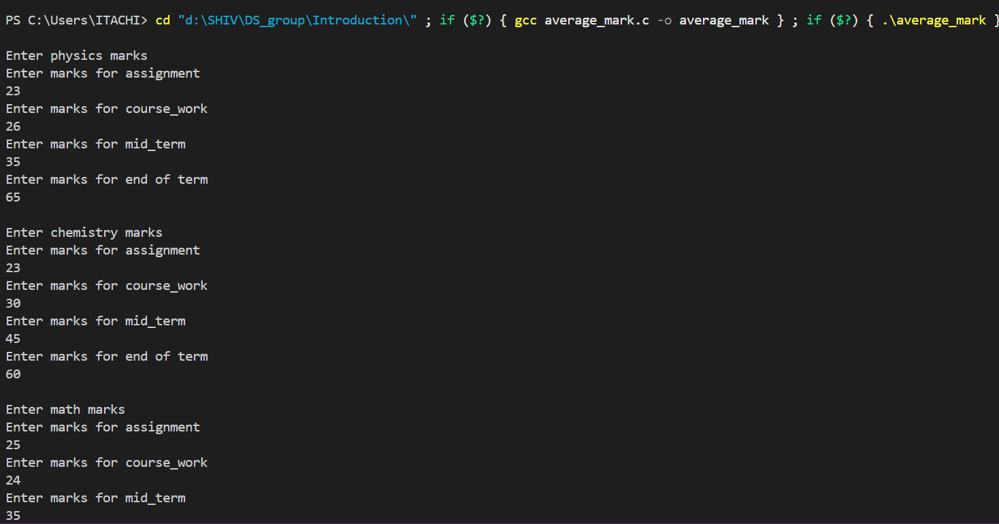
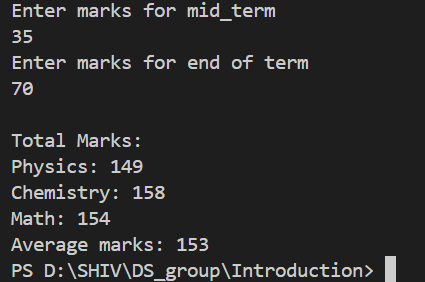
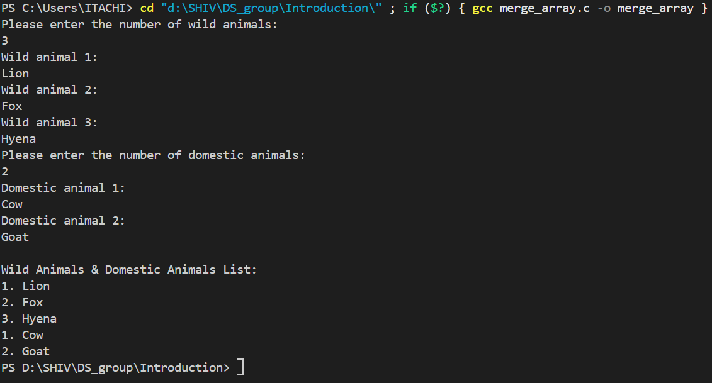

# Data Structures and Algorithms Assignments  

This repository contains all our weekly group assignments for the **Data Structures and Algorithms** course unit.  

## **Group Members**  
1. **Shiv Rajesh Jadhav**  
2. **Bablo Muammar Omar**  
3. **Jane Francis Namutebi**  
4. **Aisha Nakidde**  
5. **Apio Cynthia Penelope**
6. **Nsimbi Ronald**  

---

## **📂 Table of Contents (Click to Expand)**  

<details>
  <summary>📌 Introduction</summary>

  - [Introduction to Data Structures and Algorithms](#introduction-to-data-structures-and-algorithms)  
  - [Assignment 1](#assignment-1)  
  - [Assignment 2](#assignment-2)
  - [Assignment 3](#assignment-3)  
  - [Output Screenshots](#output-screenshots)
  - [Assignment 4](Introduction/quadratic_algorithm.txt) 

</details>

---

## **📅 26th February 2025**  

## **Introduction to Data Structures and Algorithms**  

### **Assignment 1**  
📁 *Files can be found in the [`Introduction/`](Introduction/) directory in the repo.*  

✍ **Task:**  
Write a C program that calculates the average marks of a student in three subjects: **Physics, Chemistry, and Math**.  
Each subject has four tests:  
- **Assignment**  
- **Course Work**  
- **Midterm Exam**  
- **End of Term Exam**  

### **Output Screenshots**  
#### **Screenshot 1**  
  

#### **Screenshot 2**  
  

---

### **Assignment 2**  
✍ **Task:**  
Write a C program that accepts a group of N domestic animals and a group of X wild animals.
Your program should print N + X animals after entering each group  

#### **Output Screenshot**  
  

---
## **📅 04th March 2025** 
### **Assignment 3**
Write an algorithm for a program that swaps two numbers and the pseudo code for this program.

<details>
  <summary>Algorithm and Pseudo Code</summary>
  
  ### 🖥 **Algorithm**  

  1. **START**  
  2. Declare two integer variables `a` and `b`.  
  3. Ask the user to input values for `a` and `b`.  
     - Display `a` and `b` before swapping.  
  4. Declare function `swap(int *x, int *y)` to swap values using pointers:  
     - Store `*x` (value of `a`) in a temporary variable `LOC1`.  
     - Assign `*x = *y` (swap value of `b` into `a`).  
     - Assign `*y = LOC1` (assign stored value of `a` into `b`).  
  5. Call the `LOC1` function, passing the addresses of `a` and `b`.  
  6. Print values after swapping.  
  7. **END**  

  ---

  ### 🖥 **Pseudo Code**  

  ```plaintext
  BEGIN
    DECLARE a, b as integers
    PRINT "Enter the value of a"
    INPUT a
    PRINT "Enter the value of b"
    INPUT b
    PRINT "Before swapping, a = ", a, " b = ", b

    CALL swap(address of a, address of b)

    PRINT "After swapping: a = ", a, " b = ", b
  END

  FUNCTION swap (POINTER x, POINTER y)
      LOC1 <- Value at x
      Value at x <- Value at y
      Value at y <- LOC1
  END FUNCTION
</details>
```
---
## **📅 15th March 2025**
### **Assignment 4**
**Task:**  
Derive the program steps for a quadratic time complexity algorithm.

**Solution:**  
The explanation can be found in [`Assignment_4`](Algorithms/quadratic_algorithm.txt).

<details>
  <summary>Quadratic Time Complexity (O(n²))</summary>
  
  **Quadratic time complexity O(n²)** occurs when an algorithm's execution time grows proportionally to the square of the input size (n). This often happens in algorithms that involve nested loops, where each element is compared or processed multiple times.

  ### Example: Bubble Sort Algorithm

  To illustrate O(n²) complexity, consider Bubble Sort, which sorts an array by repeatedly swapping adjacent elements if they are in the wrong order.

  #### Steps of the Bubble Sort Algorithm:
  
  1. Start with an unsorted array of size n.
  2. Loop through the array (i = 0 to n-1) to ensure all elements are sorted.
  3. For each pass, compare adjacent elements (j = 0 to n-i-1):
     - If `arr[j] > arr[j+1]`, swap them.
  4. Repeat until no swaps are needed, meaning the array is sorted.

  #### Pseudocode for Bubble Sort:

  ```text
  Function BubbleSort(arr[], n):
      For i from 0 to n-1:
          For j from 0 to n-i-1:
              If arr[j] > arr[j+1]: 
                  Swap arr[j] and arr[j+1]
      End Function
</details>
