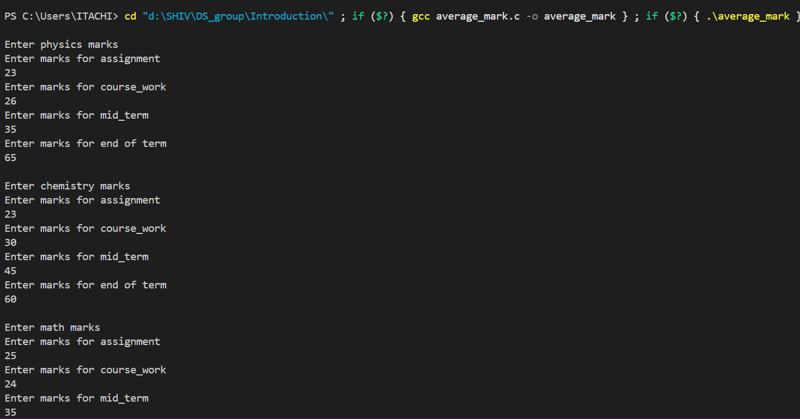
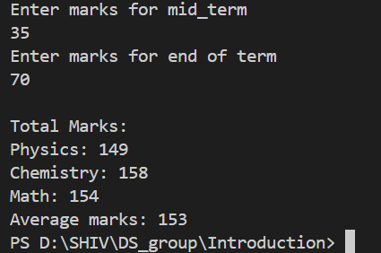
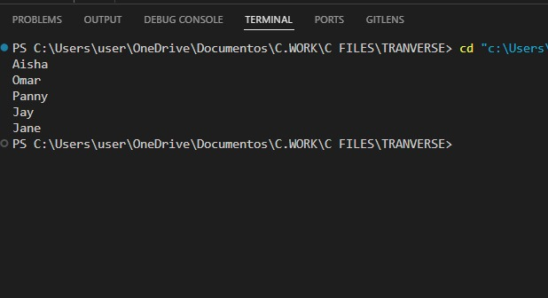
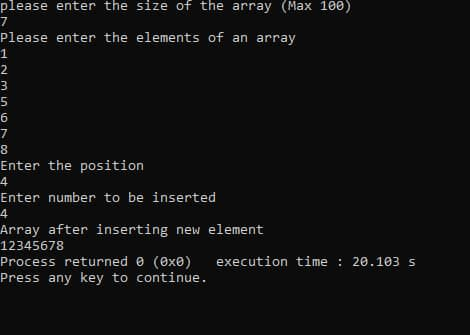
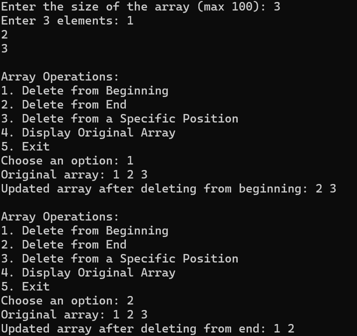
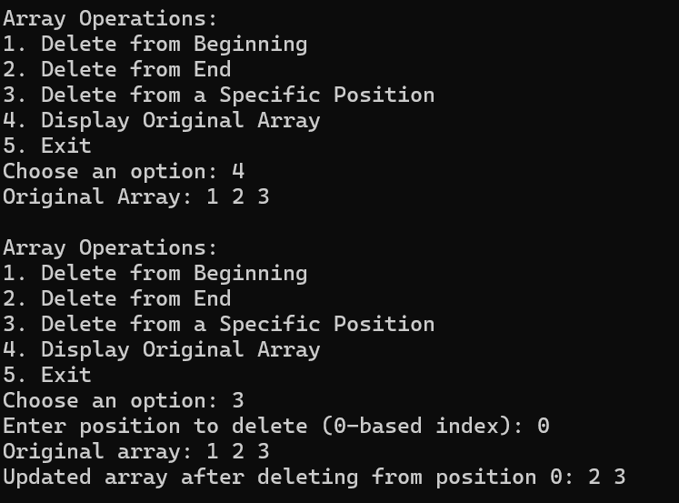

# Data Structures and Algorithms Assignments  

This repository contains all our weekly group assignments for the **Data Structures and Algorithms** course unit.  

## **Group Members**  
1. **Shiv Rajesh Jadhav**  
2. **Bablo Muammar Omar**  
3. **Jane Francis Namutebi**  
4. **Aisha Nakidde**  
5. **Apio Cynthia Penelope**
6. **Nsimbi Ronald**  

---

## **📂 Table of Contents (Click to Expand)**  

<details>
  <summary>📌 Introduction</summary>

  - [Introduction to Data Structures and Algorithms](#introduction-to-data-structures-and-algorithms)
  - [Output Screenshots](#output-screenshots)  
  - [Assignment 1](#assignment-1)  
  - [Assignment 2](#assignment-2)
  - [Assignment 3](#assignment-3)   
  - [Assignment 4](#assignment-4)
  - [Assignment 5](#assignment-5)
  - [Assignment 6](#assignment-6)
  - [Assignment 7](#assignment-7)
  - [Assignment 8](#assignment-8)


</details>

---

## **📅 26th February 2025**  

## **Introduction to Data Structures and Algorithms**  

### **Assignment 1**  
📁 *Files can be found in the [`Introduction/`](Introduction/) directory in the repo.*  

✍ **Task:**  
Write a C program that calculates the average marks of a student in three subjects: **Physics, Chemistry, and Math**.  
Each subject has four tests:  
- **Assignment**  
- **Course Work**  
- **Midterm Exam**  
- **End of Term Exam**  

### **Output Screenshots**  
#### **Screenshot 1**  
  

#### **Screenshot 2**  
  

---

### **Assignment 2**  
✍ **Task:**  
Write a C program that accepts a group of N domestic animals and a group of X wild animals.
Your program should print N + X animals after entering each group  

#### **Output Screenshot**  
  

---
## **📅 04th March 2025** 
### **Assignment 3**
Write an algorithm for a program that swaps two numbers and the pseudo code for this program.

**Please click here to expand**
👇
<details>
  <summary>Algorithm and Pseudo Code</summary>
  
  ### 🖥 **Algorithm**  

  1. **START**  
  2. Declare two integer variables `a` and `b`.  
  3. Ask the user to input values for `a` and `b`.  
     - Display `a` and `b` before swapping.  
  4. Declare function `swap(int *x, int *y)` to swap values using pointers:  
     - Store `*x` (value of `a`) in a temporary variable `LOC1`.  
     - Assign `*x = *y` (swap value of `b` into `a`).  
     - Assign `*y = LOC1` (assign stored value of `a` into `b`).  
  5. Call the `LOC1` function, passing the addresses of `a` and `b`.  
  6. Print values after swapping.  
  7. **END**  

  ---

  ### 🖥 **Pseudo Code**  

  ```plaintext
  BEGIN
    DECLARE a, b as integers
    PRINT "Enter the value of a"
    INPUT a
    PRINT "Enter the value of b"
    INPUT b
    PRINT "Before swapping, a = ", a, " b = ", b

    CALL swap(address of a, address of b)

    PRINT "After swapping: a = ", a, " b = ", b
  END

  FUNCTION swap (POINTER x, POINTER y)
      LOC1 <- Value at x
      Value at x <- Value at y
      Value at y <- LOC1
  END FUNCTION
```
</details>

---
## **📅 05th March 2025**
### **Assignment 4**

**Quadratic Time Complexity**

**Task:**  
Derive the program steps for a quadratic time complexity algorithm.

The file can be found in [`Assignment_4`](Algorithms/quadratic_algorithm.txt).

**Please click here to expand**
👇

<details>
  <summary>Quadratic Time Complexity (O(n²))</summary>
  
  **Quadratic time complexity O(n²)** occurs when an algorithm's execution time grows proportionally to the square of the input size (n). This often happens in algorithms that involve nested loops, where each element is compared or processed multiple times.

  ### Example: Bubble Sort Algorithm

  To illustrate O(n²) complexity, consider Bubble Sort, which sorts an array by repeatedly swapping adjacent elements if they are in the wrong order.

  #### Steps of the Bubble Sort Algorithm:
  
  1. Start with an unsorted array of size n.
  2. Loop through the array (i = 0 to n-1) to ensure all elements are sorted.
  3. For each pass, compare adjacent elements (j = 0 to n-i-1):
     - If `arr[j] > arr[j+1]`, swap them.
  4. Repeat until no swaps are needed, meaning the array is sorted.

  #### Pseudocode for Bubble Sort:

  ```text
  Function BubbleSort(arr[], n):
      For i from 0 to n-1:
          For j from 0 to n-i-1:
              If arr[j] > arr[j+1]: 
                  Swap arr[j] and arr[j+1]
      End Function
  ```
</details>

---
 ### **Assignment 5**
 **Algorithms and Time Complexities**
  
 **Task:**
 
Using Different algorithms of your choice, write and analyze the complexity of each algorithm using Big 0 notation.
First derive the program steps for them and Your Algorithms should cover constant, linear, quadratic and logarithmic complexity

The file can be found in [`Assignment_5`](Algorithms/All_complexities_algorithm.txt).

The sample code files can be found in [`Assignment 5`](Algorithms/sample_code).

**Please click here to expand**
👇
<details>
  <summary>All time Complexities & analysis</summary>
  
## Algorithms to be Used and Their Respective Time Complexities:
1. **Algorithm for user-input-based first element retrieval** → Constant time complexity (O(1))
2. **Algorithm to find the sum of the elements of an array** → Linear time complexity (O(n))
3. **Algorithm to pair elements of an array** → Quadratic time complexity (O(n²))
4. **Algorithm for a program that carries out a binary search** → Logarithmic time complexity (O(log n))

---

## Program #1: Algorithm for Directly Using an Element in an Array

### Algorithm:

1. **START**
2. Declare a fixed-size array.
3. Ask the user to input the first element.
4. Retrieve and print the first element.
5. **END**

### Program Steps for Algorithm 1:

| Step | Operation                         | Count |
|------|-----------------------------------|-------|
| 1    | Declare array (int arr[1])        | 1     |
| 2    | Print message (printf)            | 1     |
| 3    | User input (scanf)                | 1     |
| 4    | Function call (firstElement(arr)) | 1     |
| 5    | Access & print arr[0]             | 1     |
| **Total** |                               | **5** |

### Analysis for User-Input-Based First Element Retrieval:
- Directly accessing `arr[0]` always takes the same time regardless of user input.
- User input is a single operation that does not grow with `n`.
- **Time Complexity**: O(1).

---

## Program #2: Algorithm to Find the Sum of Elements in an Array

### Algorithm:

1. **START**
2. Ask the user to enter the size of the array `n`.
3. If `n == 0`, print "Array is empty" and exit.
4. Declare an array `arr[n]`.
5. Ask the user to input `n` elements, storing them in `arr`.
6. Initialize `sum = 0`.
7. Loop through the array and add each element to `sum`.
8. Print the total sum.
9. **END**

### Program Steps for Algorithm 2 (Linear time complexity):

| Step | Operation                                | Count |
|------|------------------------------------------|-------|
| 1    | Declare `n`                              | 1     |
| 2    | Print "Enter size"                       | 1     |
| 3    | User input (scanf) for size              | 1     |
| 4    | Check if `n == 0`                        | 1     |
| 5    | Print "Array is empty" if `n == 0`       | 1     |
| 6    | Declare array `arr[n]`                   | 1     |
| 7    | Print "Enter elements"                   | 1     |
| 8    | Loop for user input (for loop)           | n     |
| 9    | Declare sum                              | 1     |
| 10   | Loop for sum calculation (for loop)      | n     |
| 11   | Print final sum                          | 1     |
| **Total** |                                    | **8 + 2n** |

### Analysis for Finding the Sum of Elements in an Array:
- The sum requires visiting each element once.
- We must use a loop to iterate through all elements, making it O(n).
- **Time Complexity**: O(n).

---

## Program #3: Algorithm to Find All Pairs in an Array

### Algorithm:

1. **START**
2. Ask the user to enter the size of the array `n`.
3. If `n <= 1`, print "Not enough elements to form pairs" and exit.
4. Declare an array `arr[n]`.
5. Ask the user to input `n` elements, storing them in `arr`.
6. Loop through the array.
   - For each element, loop through the remaining elements.
   - Print all possible pairs.
7. **END**

### Program Steps for Algorithm 3 (Quadratic time complexity):

| Step | Operation                                                 | Count      |
|------|-----------------------------------------------------------|------------|
| 1    | Declare `n`                                               | 1          |
| 2    | Print "Enter size"                                        | 1          |
| 3    | User input (scanf) for size                               | 1          |
| 4    | Check if `n <= 1`                                         | 1          |
| 5    | Print "Not enough elements" (if applicable)               | 1          |
| 6    | Declare array `arr[n]`                                    | 1          |
| 7    | Print "Enter elements"                                    | 1          |
| 8    | Loop for user input (for i=0 to n-1)                      | 1          |
| 9    | Print "All pairs in the array:"                           | 1          |
| 10   | Nested loop for pairs (for i=0 to n-1, for j=i+1 to n-1)  | n(n-1)/2   |
| 11   | Print each pair                                           | n(n-1)/2   |
| **Total** |                                                     | **O(n²)**  |

### Analysis for Finding All Pairs in an Array:
- The nested loop forms all pairs.
- Each pair `(arr[i], arr[j])` is printed exactly once.
- **Time Complexity**: O(n²).

---

## Program #4: Algorithm to Perform Binary Search on a Sorted Array

### Algorithm:

1. **START**
2. Ask the user to enter the size of the array `n`.
3. If `n == 0`, print "Array is empty" and exit.
4. Declare an array `arr[n]`.
5. Ask the user to enter `n` sorted elements.
6. Ask the user to input the target value to search for.
7. Perform binary search:
   - Initialize `low = 0`, `high = n-1`.
   - Repeat while `low <= high`:
     - Compute `mid = (low + high) / 2`.
     - If `arr[mid] == target`, print "Found" and exit.
     - If `arr[mid] < target`, set `low = mid + 1`.
     - If `arr[mid] > target`, set `high = mid - 1`.
8. If not found, print "Element not found".
9. **END**

### Program Steps for Algorithm 4 (Logarithmic time complexity):

| Step  | Operation                                    | Count       |
|-------|----------------------------------------------|-------------|
| 1     | Declare `n`                                  | 1           |
| 2     | Print "Enter size"                           | 1           |
| 3     | User input (scanf) for size                  | 1           |
| 4     | Check if `n == 0`                            | 1           |
| 5     | Print "Array is empty" (if applicable)       | 1           |
| 6     | Declare array `arr[n]`                       | 1           |
| 7     | Print "Enter sorted elements"                | 1           |
| 8     | Loop for user input (for i=0 to n-1)         | 1           |
| 9     | Print "Enter search element"                 | 1           |
| 10    | User input for search target                 | 1           |
| 11    | Binary search loop (halving each iteration)  | log2(n)     |
| 12    | Check `arr[mid] == target` (inside loop)     | log2(n)     |
| 13    | Update `low` or `high`                       | log2(n)     |
| 14    | Print result                                 | 1           |
| **Total** |                                           | **O(log n)** |

### Analysis for Binary Search:
- Binary search halves the search space each time.
- The number of times the loop runs is at most `log₂(n)`.
- **Time Complexity**: O(log n).

---

### Conclusion:
This README outlines the algorithms used, the steps involved, and their respective time complexities. Each program demonstrates how different algorithms operate and the impact of input size on execution time. The time complexities range from constant time (O(1)) to quadratic time (O(n²)), providing a clear example of different algorithmic performance.

</details>

---
## **📅 06th March 2025**

📁 *Files can be found in the [`Arrays/`](Arrays/) directory in the repo.*

### **Assignment 6**
 **Traversing an array**
 
 **Task:**
 Write a C/C++/JAVA code showing how to traverse an array.

*Click here to open the program file 
The file can be found in [`Traversing Arrays`](Arrays/Traversing_array.c)*

 #### **Output Screenshot**  


---
### **Assignment 7**
 **Insertion into an array**
 
 **Task:**
 Write a C/C++/JAVA code showing how to insert an item into an array.

*Click here to open the program file 
The file can be found in [`Insertion Arrays`](Arrays/Insert_arrays.c)*

 #### **Output Screenshot**  
 

---
## **📅 11th March 2025**

📁 *Files can be found in the [`Arrays/`](Arrays/) directory in the repo.*

### **Assignment 8**
 **Deletion of elements from different positions of an array**
 
 **Task:**
 Write a C/C++ program showing how to delete an element from different positions (Beginning, Middle and End) of an array.
 
*Click here to open the program file 
The file can be found in [`Deletion Arrays`](Arrays/Deletion_arrays.c)*

 #### **Output Screenshot**  


---
